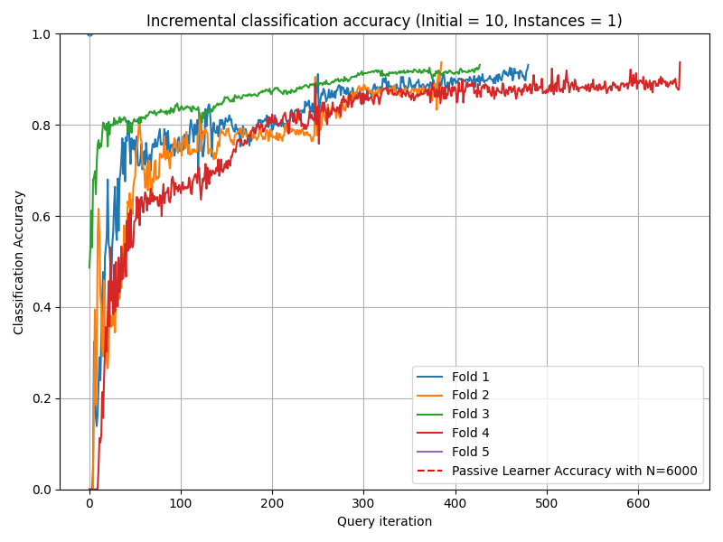
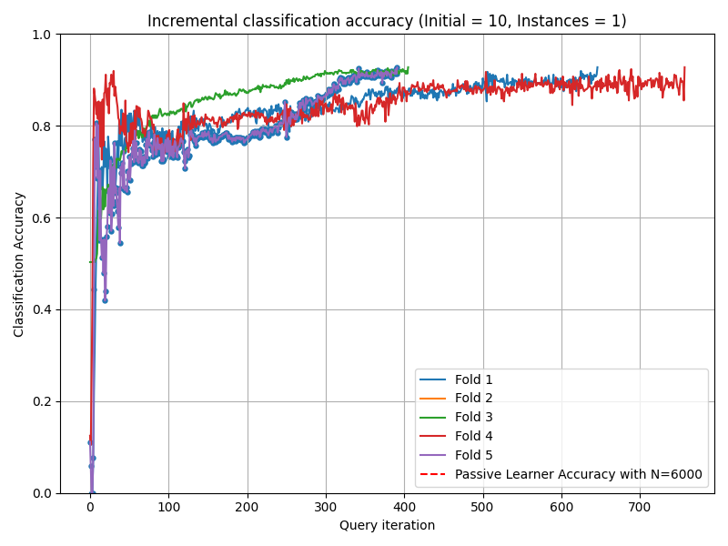
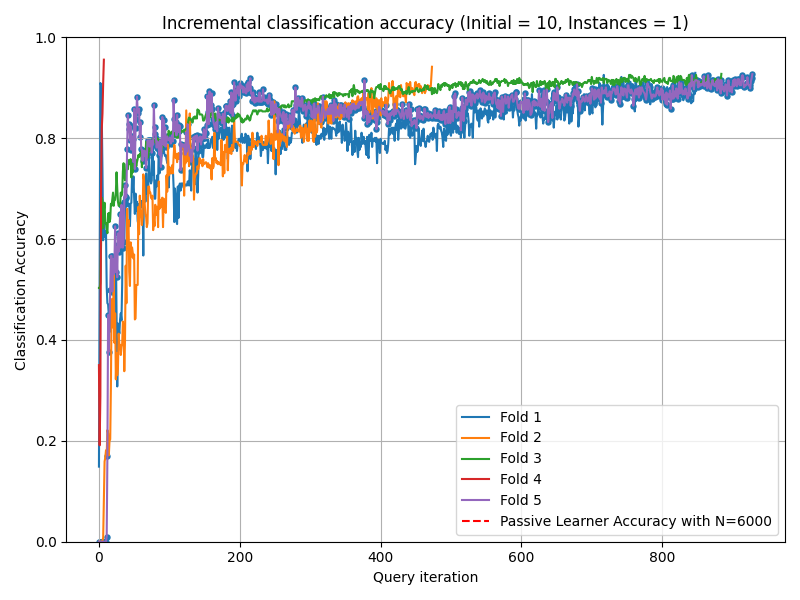

# Active Learning for Classifying 2D Grid-Based Level Completability

## Abstract
Determining the completability of levels generated by procedural generators such as machine learning models can be challenging, as it can involve the use of solver agents that often require a significant amount of time to analyze and solve levels. Active learning is not yet widely adopted in game evaluations, although it has been used successfully in natural language processing, image and speech recognition, and computer vision, where the availability of labeled data is limited or expensive. In this paper, we propose the use of active learning for learning level completability classification. Through an active learning approach, we train deep-learning models to classify the completability of generated levels for Super Mario Bros., Kid Icarus, and a Zelda-like game. We compare active learning for querying levels to label with completability against random queries. Our results show using an active learning approach to label levels results in better classifier performance with the same amount of labeled data.


# Results
## Reduction in Number of labeled data needed to train the classifiers:
The results of accuracy of the classifer after each query in Tomb game:
<div style="display: flex; justify-content: space-around;">
    <div>
        
        <p style="text-align: center;">Margin</p>
    </div>
    <div>
        
        <p style="text-align: center;">Uncertainty</p>
    </div>
    <div>
        
        <p style="text-align: center;">Random</p>
    </div>
</div>


## Time Consumption
We compared the total time of training the 5 folds for each method in each game.

| Method         | Game        | Mario   | Supercat | Cave    | Tomb    |
|----------------|-------------|---------|----------|---------|---------|
| **Random**     | Time (s)    | 5585.52 | 38740.73 | 2673.05 | 1516.38 |
| **Entropy**    | Time (s)    | 8546.22 | 6453.80  | 1242.09 | 1173.99 |
| **Margin**     | Time (s)    | 7844.88 | 41493.29 | 4238.02 | 1272.94 |
| **Uncertainty**| Time (s)    | 8271.34 | 40092.55 | 3101.18 | 951.57  |

# Reference
If you found this code useful, please consider citing our work:
```
@INPROCEEDINGS{10333212,
  author={Bazzaz, Mahsa and Cooper, Seth},
  booktitle={2023 IEEE Conference on Games (CoG)}, 
  title={Active Learning for Classifying 2D Grid-Based Level Completability}, 
  year={2023},
  volume={},
  number={},
  pages={1-4},
  keywords={Computer vision;Uncertainty;Games;Speech recognition;Machine learning;Sampling methods;Natural language processing;video games;active learning;completability},
  doi={10.1109/CoG57401.2023.10333212}}
```


  